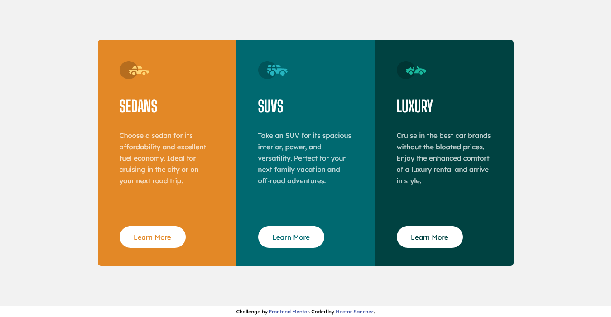

# 3-column-preview-card-component-main
 Frontend Mentor Challenge
# Frontend Mentor - 3-column preview card component solution

This is a solution to the [3-column preview card component challenge on Frontend Mentor](https://www.frontendmentor.io/challenges/3column-preview-card-component-pH92eAR2-). Frontend Mentor challenges help you improve your coding skills by building realistic projects. 

## Table of contents

- [Overview](#overview)
  - [The challenge](#the-challenge)
  - [Screenshot](#screenshot)
  - [Links](#links)
- [My process](#my-process)
  - [Built with](#built-with)
  - [What I learned](#what-i-learned)
  - [Continued development](#continued-development)
- [Author](#author)
- [Acknowledgments](#acknowledgments)

## Overview

### The challenge

Users should be able to:

- View the optimal layout depending on their device's screen size
- See hover states for interactive elements

### Screenshot

### Links

- Solution URL: [Add solution URL here](https://github.com/encoreOax/3-column-preview-card-component-main)
- Live Site URL: [Add live site URL here](https://3-column-preview-card-component-main-seven-omega.vercel.app/)

## My process

### Built with

- Semantic HTML5 markup
- CSS custom properties
- Flexbox
- Mobile-first workflow

### What I learned

This was a simple and direct project, what I can highlight is that performing this type of exercises continuously really helps to develop muscle memory in relation to solving design problems.
These vignettes could well be found as part of a larger project and be able to develop a solution that meets the design requirements it's and important skill.

### Continued development

I think that in the color of the button text there must be a way to be able to take the background color of the card and apply it directly to the text. I will investigate that.

## Author

- Website - [Hector Enrique Sánchez Coronel](https://github.com/encoreOax)
- Frontend Mentor - [@encoreOax](https://www.frontendmentor.io/profile/encoreOax)
- Twitter - [@HectorCoronel81](https://www.twitter.com/HectorCoronel81)

## Acknowledgments

There are no small projects, only new challenges.